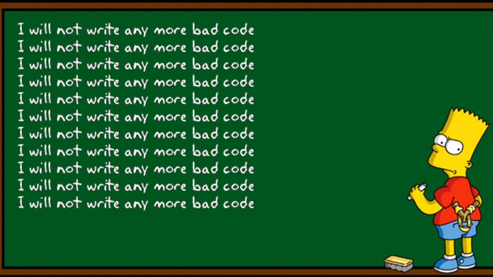

---
layout: essay
type: essay
title: "Syle and Substance"
# All dates must be YYYY-MM-DD format!
date: 2024-02-7
published: false
labels:
  - Standards
  - learning
---



<h1>Quality Assurance for Coding Insurance</h1>

  <p>Being a programmer, having some style with the substance is important. Especially if you work in a team, having your teammates be able to quickly read your code and understand it is key to success. Having a set coding standards is not only important but also I feel most people already instinctively do. In my honest opinion, people already have some coding standards. I believe this because every set of standards, whether functional programming or how many spaces you indent, helps you learn a language.</p>

  <h2></h2>
  <p>When I was a freshman learning Java all those years ago, I didn't have a set of coding standards with the exception of the check style system that even I widely ignored. At that time I was more concerned about getting the correct answer and then styling later or in many cases, never. Anyway, once I finished my assignments, when I would look back at the code I wrote I would not understand what I wrote sometimes. This was terrible when it came to studying for tests or studying in general. Looking back at it now, I do believe I wasted a lot of time relearning stuff that would have never happened if I styled properly. Now we come full circle.</p>
  
  <p>Learning Javascript is no different when it comes to having Coding Standards. In this case, I got to experience IntelliJ and ESLint. IntelliJ is IDE and ESLint is like a form of checkstyle system I mentioned before but this time unlike when I learned Java they're errors instead of warnings. I also want to mention when I program on IntelliJ it'll tell me what I just wrote. </p>

```javascript
const testNums <i>:number[]</i> =  [1, 2, 3, 4];  
```
