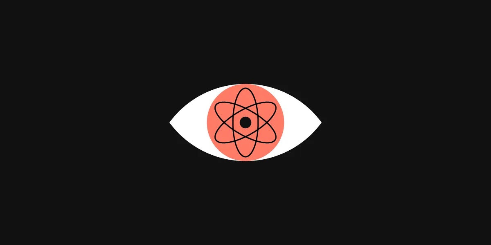

<h1>Understanding </h1> 

  
My main understanding of design patterns are that 

  <h2>Refining my designs</h2>
  
My initial understanding was something totally different, I thought it was like bootstrap where you add style to your software and boom, you got a killer site. I was wrong. After learning more I now understand it for what it is. 

  
   <h2>No Pain no Gain</h2>
  

