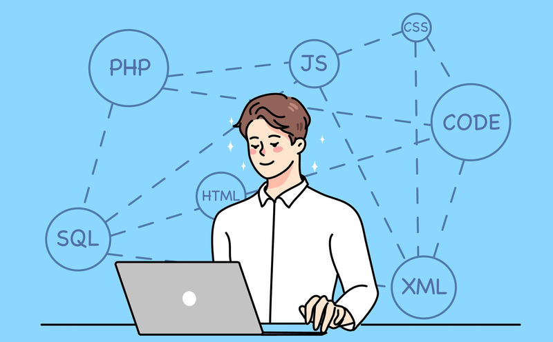

<h1>It's Not the End but It Is End of the Beginning</h1>

  
My journey in learning software engineering is over but it hasn't ended. I've learned so much not only in programming but also in real-world issues. On the programming side, there were three new languages to learn not including <i>React</i> and <i>Meteor</i> since they're kind of similar, but Javascript, HTML, and CSS were all very fun and rewarding. Learning concepts like functional programming to be extra efficient and later using these concepts in a team-building project was really fun. Not to mention the IDE we used like <i>IntelliJ</i> has been incredibly productive and I do see myself using this in the future.

  
  
Initially going in I was very skeptical, I didn't want to be a software engineer and I really did believe that it was not for me. I was also very much expecting this to be very difficult, after all learning 3 different programming languages in a semester seems very tough but luckily I can now say I was all wrong. I was really lucky and my peers all tolerated me when I was really struggling but there were also times when they needed help and that's ok because teamwork makes the dream work.

<h1>Bugging My Peers to Fix Bugs</h1>

 
One thing I'm most proud of in this journey is making new friends and being more confident as an individual. Working together is very important, especially in a software engineering environment. Learning all these new concepts was made easier because of my friends and I can't thank them enough. The same is also said with my professors since they're the ones who actually did the teaching. Working as a team and finally completing a project has taught me a lot. Even when we're not talking about programming specifically and instead discussing the ethics in software engineering, it has all been really fun and I would not have it any other way.

 
 

