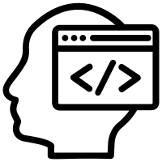

<h1>Is This Interesting?</h1>

  
I'll be honest, I'm not even sure what this is. Am I going to be making websites? am I going to survive this class? How do I even ask for help? What kinds of jobs will I be able to find with this skill set? These are questions I'll be telling myself for at least 2 months at least. besides as a requirement, I did choose this class and I do have some interest in it. I had taken a boot camp that went over HTML, CSS, and Javascript now the funny thing about this class is that it seems to do the opposite of what I had done in the boot camp.

  
Ever since I've had an interest in computers I kinda knew that I then wanted to be a game developer or something similar, as long as it was video games it was good, I guess. This class seems to have nothing with video games so that's good. (I'm being sarcastic by the way.) But with all that said I don't think this was a wrong choice, far from it actually. When I found out this class was going to be more than just software engineering and also team building and career building I knew I had to stay.

 
Something in High school that I really liked was a seminar class. That class basically helped us get into college and from what it seems ICS314 is helping us into the workforce. I wish to learn new things that I can add/improve to my resume and I think that this portfolio is a good starting point. In terms of software engineering itself, it can only help me. Whether it helps with my game dev dream or not, we'll see, but this class will definitely look good on the papers.

