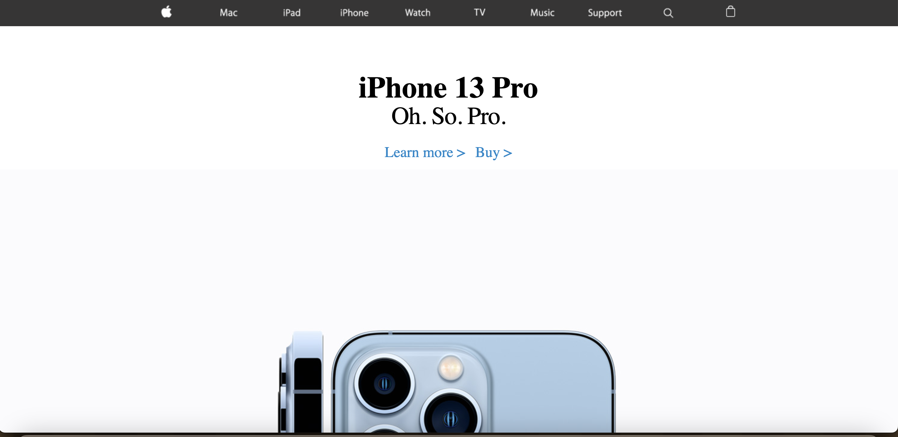

A simple Apple website using HTML and CSS. Features clickable links and images.   

<pre>
This was my first project using only HTML and CSS. The goal was to replicate an old Apple Website. I created this project when I was first learning about HTML and CSS. I used images you would see on an actual Apple Website. The website itself is formatted very similarly to an actual apple website. The layout itself contains a navbar, This is the black bar on top that simulates a navigation bar.    
</pre>

WebSite: <a href="https://wu-alvin-apple-clone.netlify.app/"><i class="large github icon "></i>Apple-Clone</a>
