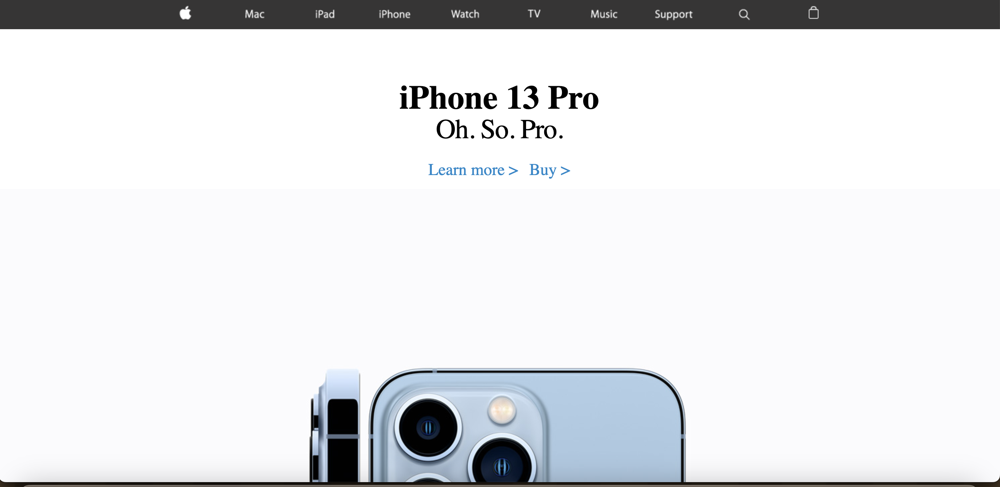

A simple Apple website using HTML and CSS. Features clickable links and images.   

 This was the beginning of a long journey towards web development. This being my first project using HTML and CSS I had lots to learn. I realized that HTML isn't really programming, it's marking. That's where the M is HTML comes from. CSS on the other hand felt more like programming but at the same time not really as well. It's pretty hard to explain. One builds the website while the other stylizes.

The goal was to replicate an old Apple Website. I created this project when I was first learning about HTML and CSS. I used images you would see on an actual Apple Website. The website itself is formatted very similarly to an actual Apple website. The layout itself contains a navbar, the black bar on top that simulates a navigation bar the images themselves are clickable links. The hero and sub-hero sections showcase the different Apple products. Finally, the footer section mimics the different navigation links at the bottom of the page. 

 I definitely learned a lot, mainly how websites are built. Before this journey, I had only heard about HTML and not even knew about CSS. This project and many assignments before this have truly opened the door to something interesting. Before I even began developing this website I kept telling myself how I would even be able to do this in the first place. I had a reference to look at and it was like 100's of lines of code for both HTML and CSS. In the end, I managed to pull it off and learned so much.

Source:<a href="https://github.com/wualvin2021/Source-Codes/tree/main/apple_clone"><i class="Source Code"></i>Apple-Clone Source Code</a>
Website: <a href="https://wu-alvin-apple-clone.netlify.app/"><i class="large github icon "></i>Apple-Clone</a>
