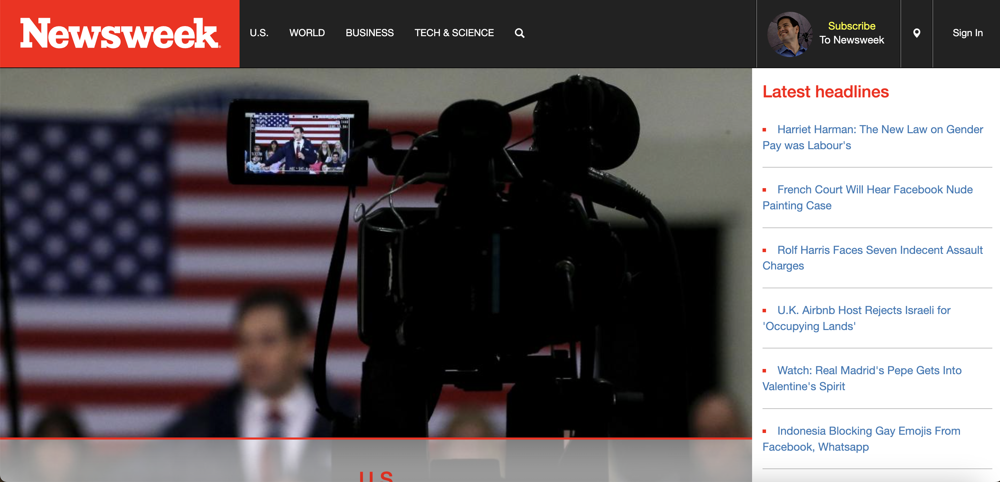

 Newsweek clone is just that, a clone of the popular news media "Newsweek." The point of the project was to get familiarized with responsive CSS, so if you're viewing this site on mobile or on a smaller window you would see that as your screen gets smaller the website would readjust itself. This project also incorporates Bootstrap for added styles. 

<p2> While I had done pretty much everything the Navbar was given to me and I had some help with the responsive CSS. This was my second project using HTML and CSS however, I almost want to say that this was mostly a CSS project than HTML. Compared to my previous project: "Apple Clone" this project was definitely more interactive and was easily the hardest part to get correct.</p2>

<p3> During this development and after I had completed I learned quite a bit about CSS and Bootstrap. Both are very crucial in how a website would look. Someone once told me that HTML is the cake batter of a website, Bootstrap is the icing on the cake, and CSS is the sprinkles and toppings of the cake. I still believe this to this day.</p3>
 
Source: <a href="https://github.com/wualvin2021/Source-Codes/tree/main/newsweek">Newsweek</a>
