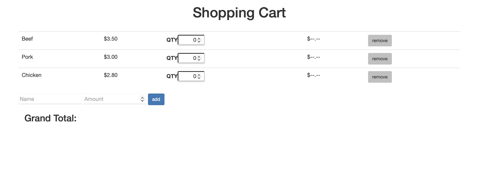

  

This shopping cart project is actually the most useful website I created. It can actually be used to calculate the total cost of your groceries or simply as a shopping list. You are able to add items you want and price them accordingly. You could set this up before you go shopping as you go shopping you edit the site to either delete the item or use it as a calculator. I may use this in the near future.

Besides being very useful it was also very rewarding. After spending a considerable amount of time grasping Javascript alongside HTML and CSS. This was the first project I had created using Javascript. I wanted this to be a project that you may actually see in real life and be useful. All my previous sites have been stuff you may see on the internet they weren't useful. At this point, I'd see myself creating more stuff like this.

While I do say this was a success, there's more I'm going to work on. I'll learn more about Javascript and not only make useful things but also make those that are pretty as well. Presentation on a site is very important, especially in a working environment. I saw this project as the first step to something great. I also wish that my next projects will always be better than the last.

Source: <a href="https://github.com/wualvin2021/Source-Codes/tree/main/simple_shopping_cart">Simple Shopping Cart</a>
