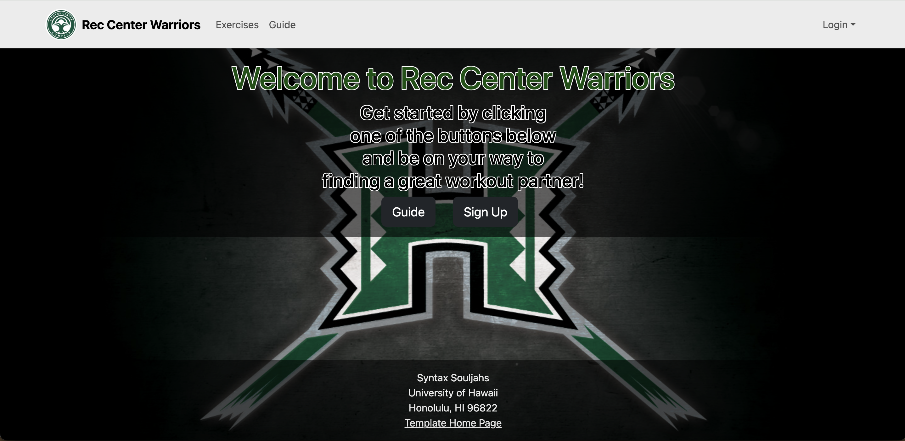

A web application that allows users to sign up and buddy up with someone to go to the gym.    

This was a group project consisting of 6 software engineering students. We wanted to create something that was both practical and useful while having fun in the process. I worked more on the front-end side like the login page, guide page, and footer.

As someone who doesn't go to the gym because of "gymtimidation" I only like to go to the gym if I have a friend. This was the reason this website was built because just like me, many others have the same fear but we still want to work out for various reasons. We've even taken feedback 

With this being the final project, it was the culmination of what I had learned in my software engineering class. Like I said, I had a lot of fun making this project come true and a big part of that was my amazing teammates. I got to work with very talented people and was able to get some confidence working with people

Source:<a href="https://github.com/Syntax-Souljahs/RecCenterWarriors"><i class="Source Code"></i>Apple-Clone Source Code</a>
Website: <a href="https://rcwarriors.fit"><i class="large github icon "></i>Apple-Clone</a>
