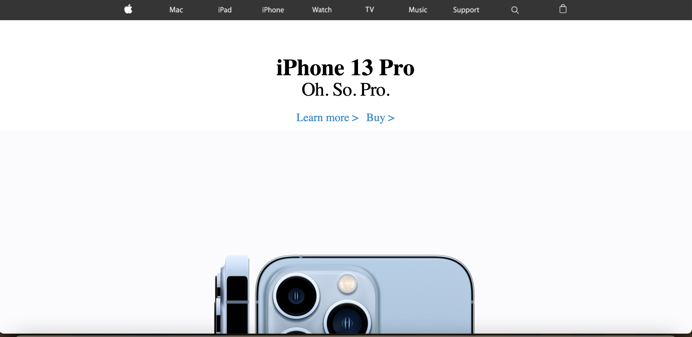

A web application that allows users to sign up and buddy up with someone to go to the gym.    

This was a group project consisting of 6 software engineering students. 

As someone who doesn't go to the gym because of "gymtimidation" I only like to go to the gym if I have a friend. This was the reason this website was built because just like me, many others have the same fear but we still want to work out for various reasons.

Source:<a href="https://github.com/Syntax-Souljahs/RecCenterWarriors"><i class="Source Code"></i>Apple-Clone Source Code</a>
Website: <a href="https://rcwarriors.fit"><i class="large github icon "></i>Apple-Clone</a>
